# 常见命令

## 开关机命令

```bash
shutdown -h now		现在立即关机
shutdown -h num		num分钟之后关机
shutdown -r now		重启计算机
h指halt关机
r指reboot重启
sync				把内存数据同步到磁盘
```

注意，优先执行`sync`之后再重启或者关机。

## 用户管理

Linux是一个多用户多任务的操作系统，任何一个使用系统资源的用户，都必须首先向系统管理员申请一个账号，然后以这个账号进入系统。

### 用户的登陆和注销

```bash
su - username		切换用户
logout				登出用户
```

### 用户的添加和删除

`root`用户能创建多个其他的用户，每个用户拥有自己的密码，并且对应一个home目录下的子目录，目录名为用户名。这个用户就是当你登陆之后，桌面所有的主目录。

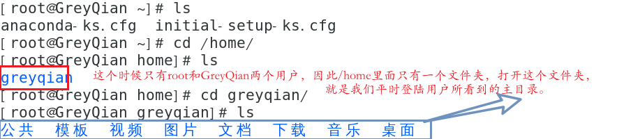

#### 用户添加

```bash
useradd 用户名
```

这个命令会为用户在`/home`文件夹下，生成默认文件名与用户名相同的文件目录。

如果想要给新建用户指定`/home`目录，可以使用`-d`参数

```bash
useradd -d 路径名 用户名
例如:useradd -d /home/test Tom
```

#### 指定修改密码

```bash
passwd 用户名
```

#### 用户删除

删除用户但是保留其家目录

```bash
userdel 用户名
```

删除用户以及其家目录

```bash
userdel -r 用户名
```

### 用户信息

**查询**

```bash
id username
```

**查看当前用户**

```
whoami 或者 who am I
```

### 用户组

设置组，方便对用户进行统一的管理。一般而言如果用户创建的时候没有设置组的话，会默认为每个用户开辟一个与之同名的组。

**添加**

```bash
groupadd 组名
```

**删除**

```bash
groupdel 组名
```

**修改用户组**

```bash
usermod -g 用户名 组名
```

**用户与组相关文件**

- `/etc/passwd`文件
  - 用户的配置文件，记录用户的各种信息
  - 每行的含义为：`用户名：口令：用户表示符：组标识号：注释性描述：主目录：登陆shell`
- `/etc/shadow`文件:
  - 口令配置文件
  - 每行的含义为：`登陆名：加密口令：最后一次修改时间.....`
- `/etc/group`文件：
  - 组的配置文件，记录`linux`包含的组的信息
  - 每行含义：`组名：口令：组标识号：组内用户列表`

## 实用指令

### 指定运行级别

- 运行级别：
  - 0：关机
  - 1：单用户
  - 2：多用户无网络服务
  - 3：多用户状态有网络服务
  - 4：系统未使用保留给用户
  - 5：图形界面
  - 6：系统重启

常用的运行级别为3和5。

切换用户级别：

```bash
init num
```

切换到num级别。

### 帮助指令

- `man`获取帮助信息：
  - 基本语法：`man 命令或者配置文件`
- `help`指令：
  - `help 命令`显示shell内置的命令的帮助

### 文件目录类指令

- 文件目录类指令
  - `pwd`:显示当前目录的绝对路径
  - `ls`:显示当前文件或者目录
    - 使用方法`ls 选项 目录或文件`
    - 常用选项：
      - `-a`:包括隐藏文件
      - `-l`：以列表的形式展现
      - `-R`：递归处理
  - `cd`:切换目录
    - 使用方法：`cd 路径`
    - 常用选项：
      - `cd ~或者cd`回到家目录
      - `cd ..`回到上一级目录
  - `mkdir`:创建目录
    - `mkdir 目录名`
    - 常用选项：
      - `-p`创建多级目录，例如`mkdir -p /home/Tom/test`相当于在`/home`目录下创建`/Tom`,然后再在`tom`目录下创建`test`
  - `rmdir`:删除空目录
    - `rmdir 选项 目录路径`
    - 如果需要删除非空目录，需要使用`rm -rf`
  - `touch`:创建空文件
    - `touch filename`
  - `cp`:拷贝文件到指定目录
    - `cp 选项 source dest`
    - 常用选项：
      - `-r`:递归复制整个文件夹
      - 如果文件有重名的，会询问是否需要覆盖，如果想全部执行覆盖,用`\cp `来替换`cp`
  - `rm`：删除文件或者文件夹
    - `rm 选项 文件或者目录`
    - 常用选项
      - `-r`:递归删除
      - `-f`:强制删除不提示
  - `mv`:移动文件目录或者重命名
    - `mv oldname newfilename`重命名
    - `mv movefile targetfile`移动文件夹
    - 例如：`mv t.txt hello/a.txt`就是移动并重命名
  - `cat`:查看文件内容
    - `cat 选项 需要查看的文件`
    - 常用选项：
      - `-n`显示行号
      - **注意与管道指令结合**
  - **`>`:重定向**
    - `content > file`将内容重定向写入file中,内容是覆盖处理的,文件不存在会自动创建
    - `ls -al > a.txt`
  - **`>>`:追加，内容是追加上去的**
    - `content >> file`
    - `ls -al >> file1`
  - `ln`:创建软链接
    - `ln -s 原文件名 软链接名`
    - 删除软链接`rm 链接名`

### 查看内容相关

- `cat`:查看文件内容

  - `cat 选项 需要查看的文件`

  - 常用选项：
    - `-n`显示行号
    - **注意与管道指令结合**
- `more`:是一个基于vi编译器的文本过滤器，它以全屏幕的方式按页来显示文本文件的内容。more指令中设置了若干快捷键帮助操作
  - 常用语法：`more 要查看的文件`
  - 操作：
    - 空格：代表显示下一页
    - `enter`:下一行
    - `q`:离开`more`不显示该文件的内容
    - `ctrl+F`:向下滚动一屏
    - `ctrl+B`：返回上一屏
    - `=`:显示当前的行号
    - `:f`:显示当前文件名和行号
- `less`:用于分屏查看文件内容，与more类似，但是功能更加强大，支持各种显示终端。
  - `less filename`
  - 功能说明：
    - 空格键:下一页
    - `q`:离开文件
    - `pagedown`:往下的光标键，向下翻页
    - `pageup`：向上翻页
    - `/字符串`:向下搜寻字符串，n为向下，N为向上
    - `?字符串`：向上搜寻字符串，n为上，N为下
- `echo`:输入内容到控制台
  - `echo 选项 输出内容`
  - 常见的输出内容
    - `$PATH`
    - `$HOSTNAME`
- `head`:查看文件开头的内容
  - `head -n num filename`查看前几行
- `tail`:查看文件结尾的几行
  - `tail -n num filename`查看倒数几行
- `history`:查看历史命令
  - `history n`查看最近使用过的n个命令，如果没有n,那就显示所有命令。
- `wc`:用于文件的计数，**注意与grep和|相结合使用**
  - `wc 选项 文件`
  - 参数：
    - `-l`:记录行数
    - `-c`:显示bytes数


### 搜索查找类

- `find`:从指定目录向下递归，遍历各个子目录，将满足条件的文件或目录显示在终端
  - `find 搜索范围 参数`
  - 参数：
    - `-name`:按照名称查找
    - `-size`：查找指定文件大小的所有文件
      - `+n 表示大于n，-n表示小于n，n表示等于n`
    - `-user`：查找属于用户名的所有文件
- `locate`:可以快速定位文件路径
  - `locate file`
  - 注意每次使用的时候，需要执行updatedb
- `which`:查看某个命令在哪个文件中
  - `which ls`
- **`grep`和`|`:grep用于过滤查找，|用于将前一个的输出结果传递给后一个命令**
  - `grep 选项 "查找内容" 源文件`
  - 选项
    - `-n`:显示匹配行以及行号
    - `-i`:忽略字母大小写

### 时间日期类

- `cal`:
- `date`:显示当前日期
  - `date`显示日期
  - `date "+%Y %m %d %H %M %S"`年月日时分秒
- `date -s`:设置日期
  - `date -s "2023-04-25 15:23:10"`
- `cal`:显示日历
  - `cal 年份`显示当前年的所有月份

### 压缩和解压缩

#### gzip压缩

- `gzip`:**压缩文件**，压缩为`.gz`的文件
  - `gzip file`
- `gunzip`:解压缩文件
  - `gunzip file `

#### zip压缩

用于**压缩文件或者文件夹**

- `zip`
  - `-r`:表示递归压缩，即用来压缩文件夹
  - `zip -r myhome.zip /home`
- `unzip`
  - `unzip file`解压到当前位置
  - `unzip -d 目录 file`将文件解压到指定的位置

#### tar

`tar`即可以用来压缩也可以进行解压缩，多个文件中间打一个空格就行

`tar -zcvf pc.tar.gz file1 file2...`压缩

`tar -zxvf file`解压

`tar -zxvf file -C 目录`解压到指定目录

- 选项：
  - `-c`：产生`.tar`打包文件
  - `-v`：显示详细信息
  - `-f`：指定压缩后端文件名
  - `-z`: 打包并压缩
  - `-x`：解包`.tar`文件
  - `-C`:解压到指定位置

# 组和权限管理

## 组

Linux的用户必须属于一个组，不能独立与组外。创立文件用户的称为文件的属主，属主是唯一可以改变文件权限的用户标识。所有者所在的组称为文件的所在组，其余的组称为其他组。

### 文件目录所有者

#### 查看

```bash
ls -alh
```

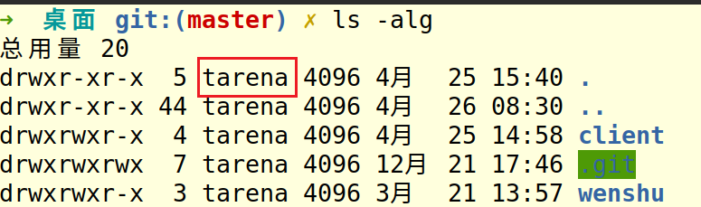

红色方框的即为文件目录的拥有者

#### 修改

```bash
chown 用户名 文件名
```

### 组的创建

```bash
groupadd 组名
```

创建用户并添加到某个组

```bash
useradd -g 用户名 组名
```

### 组的修改

#### 修改用户

```bash
usermod -g 新组名 用户名
```

改变用户登陆的初始目录

```bash
usermod -d 目录名 用户名
```

#### 修改文件

**修改文件拥有者**

```bash
chown newowner[:newgroup] 文件/目录
```

如果想同时修改group可以添加后面的内容

如果想递归修改所有文件，需要使用`-R`参数

#### 修改文件所在组

```bash
chgrp 组名 文件名
```

## 权限

### 基本概念

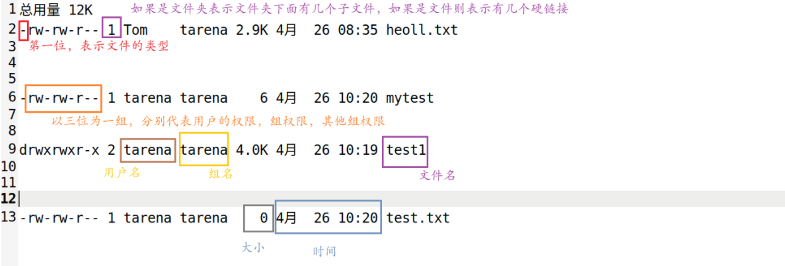

- **说明**
  - 第0位确定文件类型
    - `l`:表示链接，`d`表示目录，`c`表示字符设备文件，`b`表示块设备（如硬盘），`-`表示普通文件。
  - 第1-3位表示所有者的权限
    - `r`表示可读，`w`表示可修改，`x`表示可执行
    - `w`代表可写，但是不一定能对文件执行删除操作，还需要其父目录拥有写权限。只有可执行文件才有可执行权限。
    - 可以用8进制来表示,`r`=4,`w`=2,`x`=1,7==rwx
  - 第4-6位表示所有组的权限
    - `r`表示可读，`w`表示可修改，`x`表示可执行
    - `r`可以使用`ls`等命令，`w`可以对目录内的命令进行相应操作，`x`表示可以进入该目录
    - 同样可以用8进制表示
  - 第11位的数字
    - 文件：表示文件的硬链接数
    - 目录：该目录下有多少个文件或者目录
  - 之后就是拥有者名和所有组名
  - 之后就是文件大小，以字节为单位。
  - 日期为最后修改的日期
  - 之后为文件名或者目录名

### 权限修改

#### 使用文字修改

`u`:是所有者，`g`是所有组，`o`是其他人，`a`是所有人

`+`表示添加，`-`表示删除，`=`表示赋值

```bash
chmod u(+,-)=xxx,g=xxx,o=xxx  文件或者目录
```

注意多个之间需要以`,`隔开

#### 使用数字修改

```bash
chmod 三位8进制数 文件名/目录名
```

0-7就可以完整的表示一个的权限了

# 任务调度

任务调度是指在某个特定的时间，执行某些特定的命令或者程序。我们通常使用`crontab`来进行定时任务的设置。

**语法：**

在CentOS中，crontab命令用于设置和管理定时任务。以下是crontab命令的具体使用方法：

**查看当前用户的定时任务列表**：

```bash
crontab -l
```

该命令将列出当前用户的所有定时任务。如果当前用户没有设置定时任务，则不会显示任何内容。

**编辑或创建定时任务****

```bash
crontab -e
```

该命令将打开一个文本编辑器，允许您编辑或创建当前用户的定时任务。在编辑器中，您可以按照以下格式添加新的定时任务：

```
* * * * * command
```

其中，五个星号分别表示分钟、小时、日期、月份和星期，可以使用数字、逗号、短横线和星号来表示不同的时间值。command表示要执行的命令或脚本。

例如，以下命令将在每天的凌晨3点执行一个名为` backup.sh`的脚本：

```bash
0 3 * * * /path/to/backup.sh
```

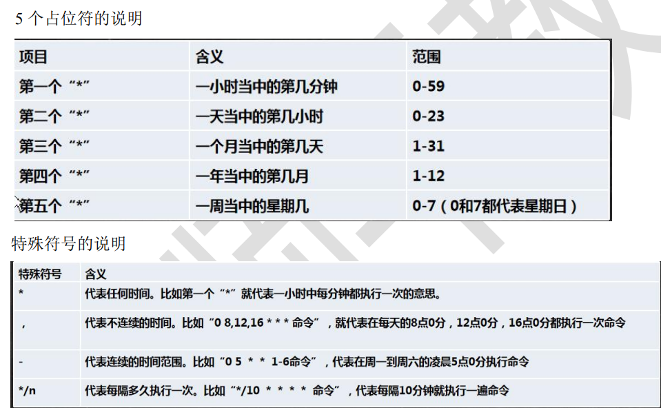

**删除定时任务**：

```bash
crontab -r
```

该命令将删除当前用户的所有定时任务。请注意，该操作不可恢复，因此请谨慎使用。

# 磁盘分区

Linux只有一个根目录`/`，在根目录下可以对再划分子目录，每一个目录都是文件系统的组成部分。我们通常使用挂载技术，将磁盘中的分区与Linux中的分区相联系起来。具体可以看示意图

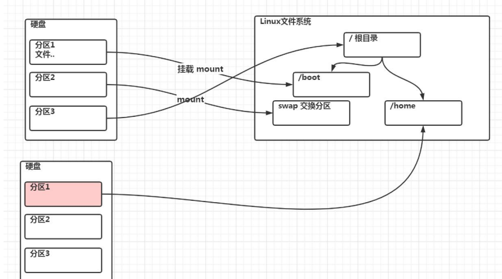

## 硬盘说明

Linux硬盘分为IDE硬盘和SCSI硬盘，目前基本上是SCSI硬盘。硬盘的驱动标识符为`**x~`，其中前两个`**`表示分区所在设备的类型，IDE硬盘为`hd`,SCSI硬盘为`sd`。第三位为盘号，a代表基本盘，b代表基本从属盘，c代表辅助主盘,d代表辅助从属盘。第四位`~`代表分区号，用1~4来表示主分区和拓展分区，从5开始的为逻辑分区。

## 查看磁盘挂载情况

使用命令`lsblk`或者`lsblk -f`

**查看指定目录的磁盘占用情况：**

```bash
du 参数 目录
```

如果不写目录，默认为当前目录

- 常见参数：
  - `-s`：指定目录占用大小
  - `-h`：带计量单位
  - `-a`：含文件
  - `--max-depth=num`:子目录的最大深度
  - `-c`:增加汇总值

**查看目录结构命令：**

```bash
tree
```

# 网络配置

## NAT网络配置原理

在NAT网络的配置下，虚拟机使用虚拟网络适配器连接到虚拟网络中，然后通过宿主机器连接到外部网络。以下是虚拟机连接到NAT网络的详细过程：

1. 创建NAT网络
   1. 在虚拟机软件中，您可以创建一个NAT网络，该网络将为虚拟机提供网络连接。NAT网络中包含一个虚拟网络适配器和一个虚拟路由器，虚拟路由器将虚拟网络连接到宿主机器的物理网络上。
2. 分配IP地址
   1. 当虚拟机连接到NAT网络时，NAT网络会自动为虚拟机分配一个IP地址，这个IP地址通常是在NAT网络的IP地址范围内。虚拟机可以使用此IP地址与其他设备进行通信。
3. 转换网络地址
   1. 当虚拟机发送数据包时，NAT网络会将虚拟机的IP地址转换为宿主机器的IP地址，并将数据包发送到外部网络。同样，当虚拟机接收到数据包时，NAT网络会将宿主机器的IP地址转换为虚拟机的IP地址，并将数据包发送到虚拟机。
4. 访问外部网络
   1. 虚拟机可以通过NAT网络访问外部网络，例如访问Internet。当虚拟机请求从外部网络下载数据时，NAT网络会将数据包发送到宿主机器，然后宿主机器将数据包发送到外部网络。当数据包返回时，NAT网络会将数据包发送到虚拟机。

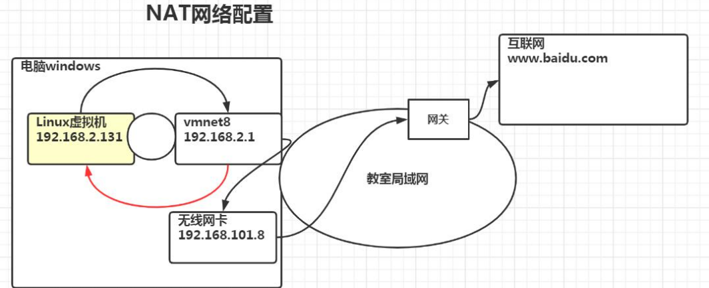

## 网络IP和网关

**查看网关**

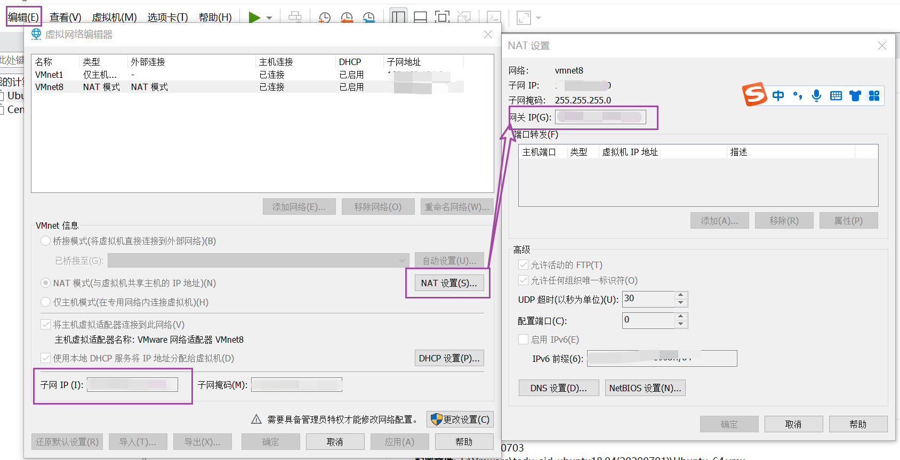

**一些命令：**

```bash
ping
ifconfig
ip 
ipconfig
```

## 网络环境配置

### 查看网络配置

- `ping`:
- `natstat 选项`
  - `-p`:显示哪个进程在使用
  - `-an`:按照顺序排列输出

### 自动获取

在登陆Linux的时候，我们可以通过页面的设置来自动获取ip，但是每次获取的ip地址可能都不一样。因此不适合做服务器。（网络->ipv4里面设置）

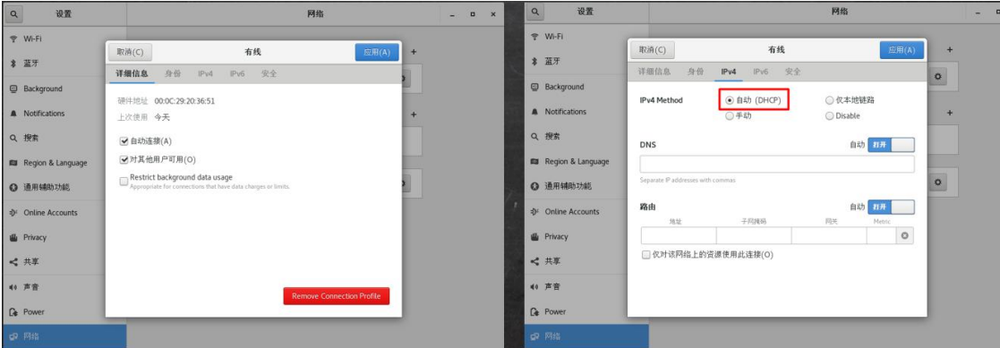

### 指定IP

通过直接修改配置文件来指定ip，并且可以连接到外网。具体编辑`/etc/sysconfig/network-scripts/ifcfg-ens33`(`CentOS`版本的)，具体建议问`ChatGPT`，下面给出ubantu版本的。

要手动更改`Ubuntu`的`IP`地址，可以按照以下步骤进行操作：

打开终端，输入命令`sudo nano /etc/network/interfaces`，进入网络配置文件。

找到当前网络接口的配置信息。一般情况下，标准配置应该是类似这样的：

```bash
auto eth0
iface eth0 inet dhcp
```

将`dhcp`修改为`static`，表示手动分配`IP`地址。然后在下面添加以下内容：

```bash
address 192.168.0.100   # 设定IP地址
netmask 255.255.255.0   # 设定子网掩码
gateway 192.168.0.1     # 设定网关
```

请注意，以上内容中的`IP`地址、子网掩码和网关应该根据实际情况进行修改。

修改完成后，按``Ctrl+X`键退出编辑器，输入Y保存更改。

重启网络服务，输入命令`sudo service networking restart`。

这样，`Ubuntu`的`IP`地址就被手动更改了。

**注意之后还需要对VMware部分的进行修改**

## 设计主机名和host映射

为了方便管理可以为主机设置主机名

**查看主机名**

```bash
hostname
```

**修改主机名**

```bash
vim /etc/hostname
```

重启之后生效

**设置host映射**

`Hosts`是一个文本文件，用来建立主机名和`ip`地址的关系。`DNS`(域名系统)，是互联网上，作为域名和`IP`地址相互映射的一个分布式数据库。当我们访问一个网址的时候，浏览器会首先检查有无缓存该域名解析的`ip`地址，若无。就去检查本地的`DNS`缓存，若还没有，就会去本地解析器缓存中查找（具体去查找`hosts`文件）如果上述过程都没有查找到，那么才会去到`DNS`域名解析器中查找。因此我们可以建立主机名和`ip`地址的映射关系，建立一个本地映射，即可用过主机名来访问。

- windows：
  - 在`c:\windows\system32\drivers\ect\hosts`文件中`your_ip your_hostname`指定即可
- linux:
  - 在`/ect/hostname`中指定


# 进程管理

## 显示进程

- `ps`:显示进程的执行信息
  - 参数
    - `-a`:显示当前终端所有进程的信息
    - `-u`:以用户的形式显示
    - `-x`:显示后台进程运行的参数
    - `-e`:显示所有进程信息
    - `-f`:以全格式显示
  - 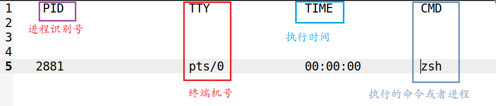
  - 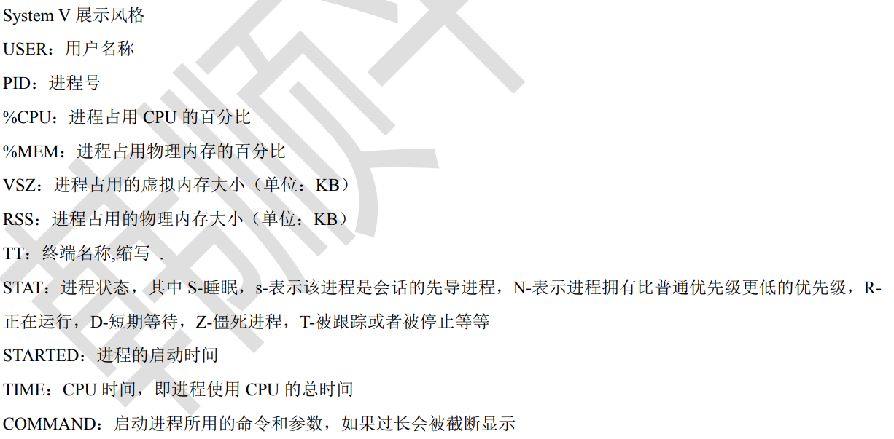

- `pstree`:以树状的形式查看
  - 参数
    - `-p`显示PID
    - `-u`显示用户
- `top`:动态检测进程
  - `top 选项`
  - 常见选项：
    - `-d num`:指定num秒更新，默认是3秒
    - `-p`：通过指定进程id来监视某个特定进程
    - `-i`: 不显示闲置或者僵死的进程


## 杀死进程

可以使用`kill`命令来终止进程。

```bash
kill 选项 进程号      	杀死特定进程
killall 进程名称      	 通过进程名称杀死进程
```

常用选项：

- `-9`:强制杀死进程

## 服务管理

Linux中的服务本质是运行在后台的进程，用于提供特定的功能或服务。服务通常在系统启动时自动启动，并在后台持续运行，提供服务给其他程序或用户使用。我们通常使用`service`或者`systemctl`来进行管理。

### service

`service`能管理的命令一般都放在`/etc/init.d`中。我们一般使用`ls -l /etc/init.d`这个命令来查找`service`能够管理的服务。

**管理指令：**

```bash
service 服务命令 stop|start|restart|reload|status
```

其中`|`表示几个中，选一个。

### systemctl

```bash
systemctl start|stop|restart|status 服务命令
```

其中管理的命令放在`/user/lib/systemd/system`

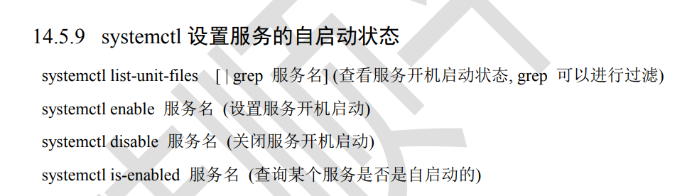


# 下载包

## CentOS

### rpm

`rpm`是`CentOS`,`RedHat`等Linux版本的管理安装包的工具。它可以自动处理软件依赖关系，下载和安装软件包，同时还可以管理软件包的更新和卸载。

**常见命令**

- 查询已安装的的软件安装包：
  - `rpm -qa`
  - 显示的格式为：`名称 版本号 操作系统`，例如`firefox-60.2.2.1 el.centos.x86_64`
- 查询软件包是否安装
  - `rpm -q 软件包`
- 查询软件包信息：
  - `rpm -qi 软件包`
- 查询软件包中包含的文件
  - `rpm -ql 软件包名`
- 查询文件所属的文件包
  - `rpm -qf 文件路径`
- 卸载包
  - `rpm -e 软件包`
- 安装包
  - `rpm -ivh 软件包`

### yum

相当于在服务器去下载安装包到本地。

**常用命令**

- 查询服务器是否有包
  - `yum list | grep 软件包`
- 下载安装
  - `yum install 软件包`

## Ubantu

适合于`python`开发。`apt`全程`advance packing tool`,是一款安装包管理工具，我们使用其用于软件包的安装，删除，清理。

### 调整页面大小自适应

有几种方法，可以添加`vmtool`，这里推荐另外一种方法，利用第三方包来实现。

安装包，然后重启就可以了。

```bash
sudo apt-get install open-vm-tools-desktop
reboot
```

如果安装包失败，可以试一试这条指令：`sudo apt-get intall open-vm*`

搭建clash,看这篇文章[Ubuntu下使用Clash For Windows - ^@^.* (hiif.ong)](https://hiif.ong/clash/)

### 常见下载命令

```bash
sudo apt-get update					更新源
sudo apt-get install package		 下载包
sudo apt-get remove package			 删除包
sudo apt-get remove package --purge   删除包包括配置文件
sudo apt-get build-dep package		 安装相应的编译环境
sudo apt-get upgrade				 更新包
sudo apt-get dist-upgraded			 更新系统
sudo apt-cache show package 		 展示包的相关信息，比如大小等
sudo apt-cache search package		 搜索相关包
sudo apt-get install package --reinstall	 重新安装包
sudo apt-get source package			 下载包的源代码
sudo apt-cache depends package		  了解该包依赖那些包
sudo apt-cache rdepends package		  了解该包被那些包依赖
```

### 更改镜像源

在`/etc/apt/source.list`中记录着美国的服务器地址，当我们使用`apt`指令来进行安装的时候，实质上，就是通过网关，到美国的服务器上去请求数据，但是由于距离和网络不稳定原因，这个速度就很慢，导致`apt`功能无法实现，这个时候，国内的一些机构就会去这些服务器上，下载那些包，并咋国内建立相应的服务器来供大家下载使用这些包，这就使得我们的下载速度会得到极大的提升，这就是镜像源的原理。

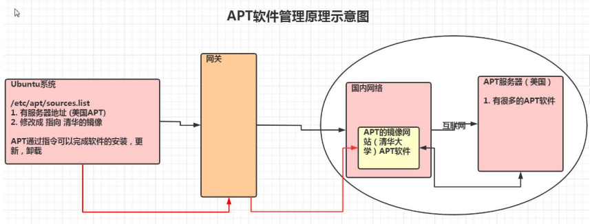

更改镜像源一般有两种方法，一种是直接在图形化界面更改，宁外一种就是使用命令行更改。

####  图形化界面

在 Ubuntu 中，可以通过图形界面或命令行方式修改软件源。以下是在图形界面上修改软件源的步骤：

1. 打开 "软件和更新" 应用程序

   在 Ubuntu 中，可以点击左上角的 "活动" 按钮，然后在搜索框中输入 "软件和更新"，点击搜索结果中的 "软件和更新" 应用程序图标，打开该应用程序。

2. 选择软件源

   在 "软件和更新" 应用程序中，点击 "Ubuntu 软件" 选项卡，然后在 "下载自" 下拉菜单中选择一个软件源，例如 "中国大陆"，系统会自动检测并选择最快的镜像源。

3. 更新软件源列表

   点击 "关闭" 按钮，系统会提示是否重新加载软件源列表，点击 "是" 即可更新软件源列表。

4. 完成修改

   更新完成后，您可以使用以下命令检查软件源是否已经修改成功：

   

   ```bash
   cat /etc/apt/sources.list
   ```

   系统会输出当前使用的软件源列表，检查是否已经切换到了新的软件源。


#### 命令行更改

以下是在 Ubuntu 20.04 上使用命令行将软件源修改为清华镜像源的步骤：

1. 备份原软件源列表

   在修改软件源之前，建议先备份原软件源列表，以便需要恢复时可以使用。可以使用以下命令

   ```bash
   sudo cp /etc/apt/sources.list /etc/apt/sources.list.bak
   ```

2. 修改软件源列表

   打开 `/etc/apt/sources.list` 文件，并使用文本编辑器编辑该文件：

   ```bash
   sudo nano /etc/apt/sources.list
   ```

   在编辑器中，将当前的软件源地址替换为清华镜像源地址。例如，如果您使用的是官方的 Ubuntu 20.04 软件源，可以将以下内容：

   ```bash
   deb http://archive.ubuntu.com/ubuntu/ focal main restricted universe multiverse
   deb http://archive.ubuntu.com/ubuntu/ focal-updates main restricted universe multiverse
   deb http://archive.ubuntu.com/ubuntu/ focal-backports main restricted universe multiverse
   deb http://security.ubuntu.com/ubuntu/ focal-security main restricted universe multiverse
   ```

   替换为以下内容：

   ```bash
   deb https://mirrors.tuna.tsinghua.edu.cn/ubuntu/ focal main restricted universe multiverse
   deb https://mirrors.tuna.tsinghua.edu.cn/ubuntu/ focal-updates main restricted universe multiverse
   deb https://mirrors.tuna.tsinghua.edu.cn/ubuntu/ focal-backports main restricted universe multiverse
   deb https://mirrors.tuna.tsinghua.edu.cn/ubuntu/ focal-security main restricted universe multiverse
   ```

   注意：清华镜像源地址中的 "focal" 表示 Ubuntu 20.04 的代号，如果您使用的是其他版本的 Ubuntu，需要将 "focal" 替换为相应的代号。

3. 更新软件源列表

   在保存修改后，使用以下命令更新软件源列表：

   ```bash
   sudo apt-get update
   ```

   系统会自动从清华镜像源下载软件包索引文件，更新完成后，您可以使用以下命令检查软件源是否已经修改成功：
   
   

   ```bash
   cat /etc/apt/sources.list
   ```

   系统会输出当前使用的软件源列表，检查是否已经切换到了清华镜像源。


### 远程登陆

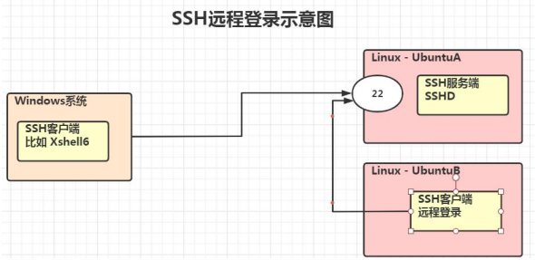

因为`ubuntu`默认没有安装`ssh`，因此我们需要首先安装并启用`ssh`服务，才能使用`xshell`建立连接。

```bash
sudo apt-get install openssh-server
service sshd start
```

**windows上我们通常使用Xshell来进行登陆，如果Linux的话有所不同，具体如下：**

```bash
ssh 用户名@ip地址            登陆
logout 或者 exit            登出
```

# 日志管理

日志用于记录系统中发生的重大事件，通常保存在`/var/log/`文件中。

系统的常用日志主要有

| 日志类型     | 对应文件名                  | 描述                                                         |
| ------------ | --------------------------- | ------------------------------------------------------------ |
| 系统日志     | /var/log/syslog             | 记录系统启动和关闭信息，以及其他系统级别的信息               |
| 内核日志     | /var/log/kern.log           | 记录内核消息，包括硬件错误、内核警告、内核崩溃等             |
| 身份验证日志 | /var/log/auth.log           | 记录用户身份验证信息，包括登录、注销、sudo使用等             |
| 应用程序日志 | /var/log/applications/      | 记录应用程序的日志信息，不同的应用程序可能会有不同的日志文件 |
| 系统进程日志 | /var/log/syslog             | 记录系统进程的日志信息，包括系统服务、定时任务等             |
| 安全日志     | /var/log/auth.log           | 记录安全相关的日志信息，包括用户登录、sudo使用、防火墙等     |
| 访问日志     | /var/log/apache2/access.log | 记录Apache2服务器的访问日志信息                              |
| 错误日志     | /var/log/apache2/error.log  | 记录Apache2服务器的错误日志信息                              |
