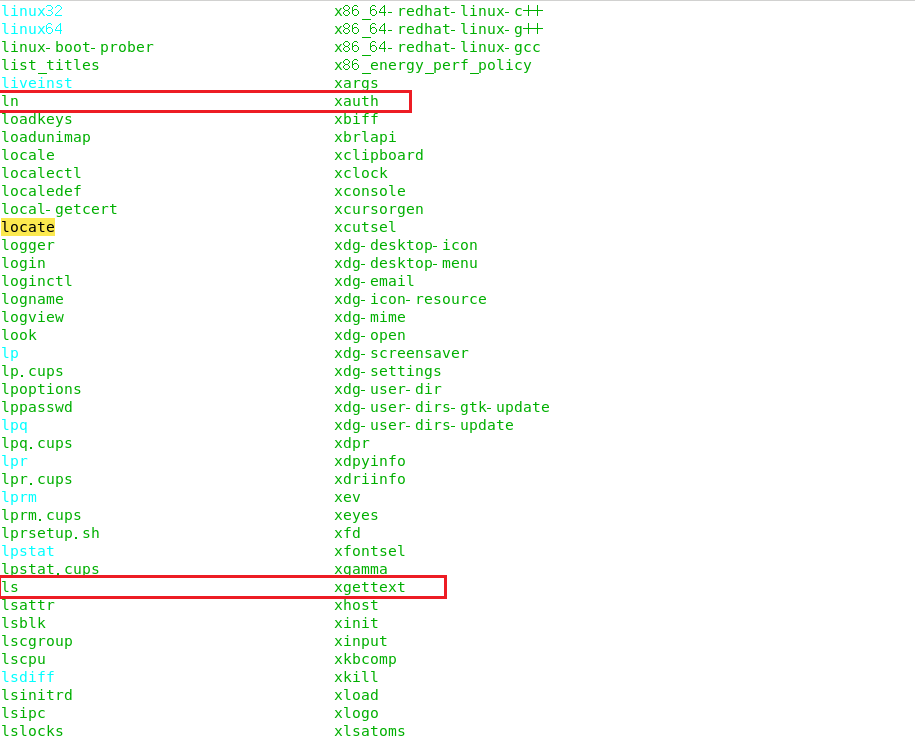
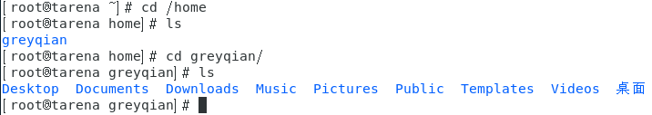
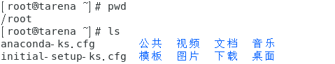
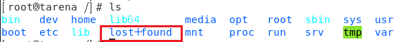

# Linux文件目录结构

## 基础概念

### 文件分类

文件通常分为三类：

- 普通文件：
  - 文本文件
    - 例如：文本，脚本，源程序，配置文件等
  - 二进制文件
    - 例如：包含非文本数据，例如：图像，音乐，视频，数据库等
- 文件目录：
- 伪文件：
  - 本身不占用空间，主要用来提供各种服务
  - 例如：设备文件，命名管道，proc文件

### 伪文件

#### 特殊文件

特殊文件是表示物理设备的伪文件，一般放在`/dev`（设备）目录之中，这部分的文件通常供给系统使用，具体可以分为如下三部分。

##### 硬件特殊文件

这部分主要是硬件相关的文件，如下表

| `/dev/fd0`  | 软盘             |
| ----------- | ---------------- |
| `/dev/sda`  | SCSI硬盘         |
| `/dev/sda1` | 硬盘的第一块分区 |
| `/dev/lp0`  | 打印机           |

##### 终端特殊文件

与硬件的终端相关，一般为`/dev/tty数字`的格式

| `/dev/tty`   | 当前终端 |
| ------------ | -------- |
| `/dev/tty1`  | 控制台   |
| `/dev/pts/0` | 伪终端   |
| `/dev/ttyp0` | 伪终端   |


##### 伪设备特殊文件

充当输入源或者输出目标的文件

| `/dev/null`    | 放弃输出，输入不返回内容(eof) |
| -------------- | ----------------------------- |
| `/dev/zero`    | 放弃输出，输入不返回内容(0)   |
| `/dev/random`  | 随机数生成器                  |
| `/dev/urandom` | 随机数生成器                  |

#### 管道

我们通常使用`|`来创建管道，这种创建的管道是匿名的，但是我们还可以通过创建有名的管道来进行进程之间的通信。创建管道的语法为：

````sh
mkfifo pipe_name
````

管道的本质就是一种特殊的文件，因此可以像对文件一样处理管道

注意使用之后需要删除管道

```sh
rm pipe_name
```


#### proc文件

`proc`文件是用来提供一种方便查找使用提供系统信息的伪文件的一种文件。通常这些信息放在`/proc`目录下，常见的文件有。

| proc文件            | 相关信息         |
| ------------------- | ---------------- |
| `/proc/xxxx`        | 进程#xxxx        |
| `proc/cmdline`      | 处理器           |
| `/proc/devices`     | 设备             |
| `/proc/filesystems` | 文件系统         |
| `/proc/medules`     | 内存             |
| `/proc/swaps`       | 交换分区         |
| `/proc/version`     | 版本             |
| `/proc/partitions`  | 磁盘分区         |
| `/proc/mounts`      | 挂载设备和挂载点 |

### 挂载系统

因为整个文件过于庞大，放在一块连续的磁盘空间上是很难实现的，挂载系统就是用于实现将文件的不同部分，放在不同的磁盘中以方便我们对文件实现扩展。通常将小文件系统的根目录连接到主文件系统的特定目录这种方式称为**挂载（mount）**，反之当断开文件系统的时候称为卸载**（unmount）**

## 目录结构

Linux的文件系统采用层级式的目录结构，此结构中最上层的目录结构是根目录`root`（windows有多个盘符，例如C,D,E盘。Linux中只有一个根目录），然后在此目录下再创建其他目录。在Linux中一切皆文件，文件对于Linux很重要。

因为每次输入`root`过于麻烦，因此我们使用`/`来代替根目录。当然我们也会使用`/`作为文件名的界定符号，充当连接父子文件之间的桥梁。

**常见的目录结构**

### `/bin`

是binary的缩写，这个目录存放一些最常用**命令**和基本的程序。存放着系统管理员在但用户模式下管理系统所需要的一些基本工具。这些文件都是二进制可执行文件，可以认为该目录是程序的管理箱。




### `/sbin`

s是super user的意思，这里一般用来存放系统管理员使用的系统管理程序。例如：`/usr/sbin`,`/usr/local/sbin`

### `/home`

存放普通用户的主目录,Linux中每个用户都有一个自己的目录，一般以用户的账号名来命名该目录名。这个目录用来存放每个用户创建的文件夹以及相应的内容。但是root用户的home在`/root`中。通常我们会使用`~`来代替我们当前所在的home目录。



### `/root`

是超级用户的用户主目录。



### `/lib`

是系统开机所需要最基本的动态连接库（已存在的数据和代码），其作用类似于windows中的DLL文件。几乎所有的应用程序都需要用到这些共享库。

### `/lost+found`

当系统受到非法关机后会在这里存放日志文件，一般情况下是空的。`unix`中的文件如果出错，在下次登陆的时候，会有`fsck`程序检查问题，然后将损坏的文件尽量修复放入这个文件下。



### `/etc`

所有的系统管理所需要的**配置文件**和**子目录**，比如安装MySQL数据库的my.conf。

常见的有：

- `/etc/hosts`:查看主机名称和ip地址
- `/etc/passwd`：查看用户标识的基本信息
- `/etc/profile`：用户标识登陆之后，系统自动执行的命令

### `/usr`

是辅助文件的根文件，主要用于存放静态文件，是一个很重要的文件挂载点。类似于windows的`program files`目录，用户的很多应用程序和文件偶读放在这个目录下。

常见如下：

- `/usr/bin`:是可执行文件主要存放的位置，大多数的可执行文件放在这个部分
- `/usr/games`：存放着一些游戏
- `/usr/include`：c语言常用的头文件
- `/usr/lib`：存放着一些库
- `usr/local`：存放本地程序和资料的位置
- `usr/share`：存放着大量的惊天数据，比如图片文字信息等。例如：man手册就存放在这个部分，还有很多程序的图标等
- `/usr/src`：包含有系统源代码的子目录

### `/boot`

用于存放启动Linux时候需要使用的一些核心文件。内核必须放在这个文件目录或者根目录下。

### `/proc`

是一个虚拟目录，是系统内存的映射，访问这个目录来获取系统信息

### `/srv`

service的缩写，用于存放服务启动之后需要提取的数据

### `/sys`

是Linux内核的一个文件，存放了一个新出现的文件系统syfs.

### `/tmp`

用于存放临时文件

### `/dev`

类似于windows的设备管理器，把所有的硬件用文件的形式来存储。所有的特殊文件都放在这个目录下，其中大多数是设备文件，其中该文件中还包含了`makedev`的一个程序用来创建新的特殊文件。

### `/media`

linux系统会自动识别一些设备，例如U盘等，当接入之后，linux会把识别的设备挂载到这个目录下

### `/mnt`

为了让用户临时挂载别的文件系统，例如我们可以将外部的存储挂载在`/mnt`上，然后进入该目录就可以查看里面的内容

### `/opt`

安装第三方应用程序（optional software）的位置。

### `/usr/local`

是宁外一个给主机安装软件的目录。一般是通过编译源码安装的程序放在此目录。

### `/var`

辅助文件系统的根，但是存放的是动态的数据。存放这不断扩充的东西，习惯将经常被修改的目录放在这个目录下。比如各种日志文件等

### `selinux`

是一种安全子系统，他能控制程序只能访问特定的文件，有三种工作模式可以自行设置。

