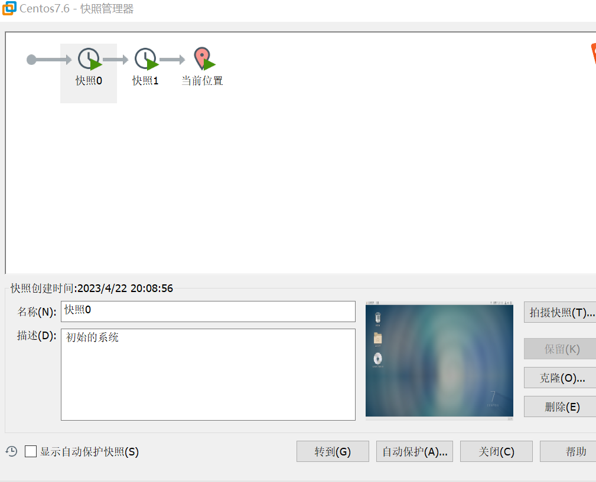
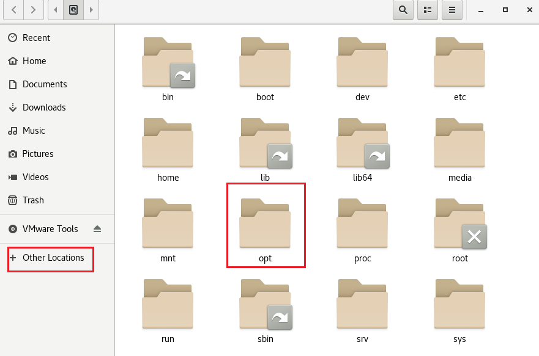
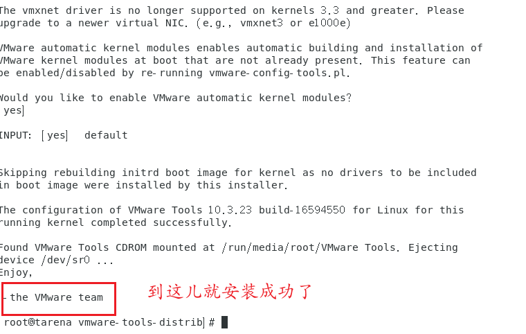

# Linux环境搭配

## 虚拟机搭建Linux环境

Linux是一个操作系统内核，但是对GUI等页面支持的并不好。因此有很多人在内核的基础上进行了在一层的封装，让其功能更加完善，成为了Linux的发行版。常见的Linux发型版主要有ubantu（主要用于Python开发），和centOS(主要适用于从C,C++,Java开发)。安装Linux操作系统有两种方法，一种是直接再裸机上安装系统，宁一种是借助虚拟机（VMware等）安装系统。这里主要用虚拟机安装系统。

安装教程网上有很多，推荐去B站看韩顺平老师的视频

### 虚拟机的克隆

如果已经安装好虚拟机之后，再次安装虚拟机就不用在一步一步安装，可以选择直接克隆已经安装的环境。具体的方法有如下两种：

1. 直接拷贝一份已经安装好的文件，这个文件就是你安装的时候，安装到虚拟机的目录
2. 使用VMware，`右键-->管理-->克隆-->克隆至虚拟机当前状态-->创建完整克隆`，选好相应位置即可。

### 虚拟机的快照

类似于`git`的快照管理，其目的是为了让我们能够回到之前虚拟机的状态。

每当我们觉得虚拟机的某个状态有必要创建一个快照的时候，我们可以右键来添加一个快照，如果需要切换可以直接管理快照，选中需要切换的然后点击`转到`就可以了。

### 虚拟机的迁移和删除

本质上就是对安装文件的操作。

### 文件共享

#### 安装vmtools

vmtools是一个帮助我们在windows下更好的管理VM虚拟机的一个工具，有了它就能帮助我们设置windows和centos的共享文件夹。

**步骤：**

1. 进入centos
2. 点击VM菜单中的`install vmware tools`
3. centos中会出现一个vm的安装包，`xxx.tar.gz`
   1. 
4. 拷贝到`/opt`
   1. **注意需要使用root账户登陆权限才能粘贴**
5. 使用命令`tar`解压得到安装文件
   1. `tar -zxvf xxx.tar.gz`
6. 进入解压目录，`/opt`目录下
   1. `./xxx.pl`会自动安装
7. 安装使用默认设置即可（注意：**需要有gcc才能安装成功**）
   1. 遇到选项，一路按`enter`即可
   2. 

#### 设置文件共享

在主机上创建一个文件夹，进入VMware点击虚拟机，右键设置，选项，启动文件共享，然后设置共享的文件路径（就是刚创建那个文件夹）。共享的文件夹，在linux中`./mnt/hgfs/创建的文件夹名`。但是在实际开发中，我们通常利用远程登陆的方式来传输文件。

## 远程登陆

在开发中一般需要远程登陆虚拟机，来操控linux主机。我们一般使用Xshell来远程登陆，使用Xftp来对文件进行远程传送。

在配置的时候只需要注意名称可以任意，但是主机名只能选择你虚拟机的ip地址即可。

