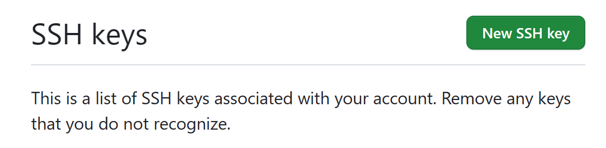
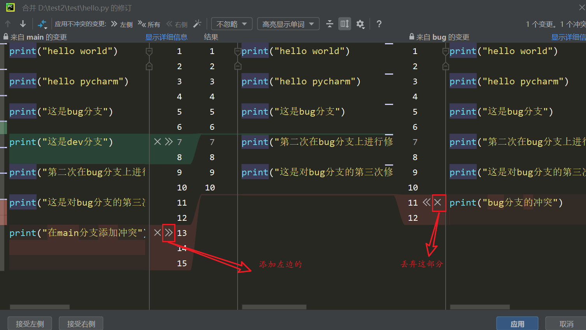
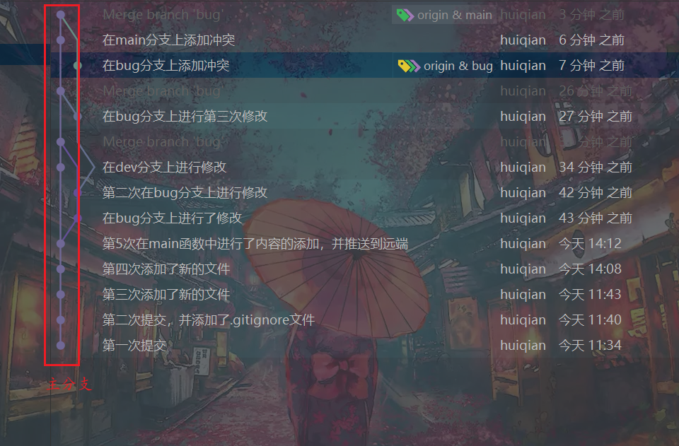

# Git

[TOC]

## Git常用命令

### git概述

- 基本概念
  - 工作区，写代码的地方（代码存放的位置）。在工作区操作代码是和我们平时使用是一样的，无法恢复。
  - 暂存区，对工作区`git add`之后，将内容存储到暂存区，用于临时存储内容。`git commit`之后，将暂存区的内容提交到本地库。
  - 本地库，存放着历史版本。提交到本地库的版本理论上是无法彻底删除的，都可以恢复回来。
- 代码托管中心
  - 即远程仓库，一般有如下几种
    - 局域网
      - GitLab
    - 互联网
      - GitHub
      - Gitee

### 常用命令

#### 设置用户签名

```bash
git config --global user.name  用户名
git config --global user.email 邮箱
```

签名的作用是区分不同操作者的身份，以便于后续确认是谁做的提交。配置好之后，会生成`.gitconfig`的配置文件，里面存储配置的信息。**Git安装之后必须对用户签名进行配置**，且这里的用户签名与将来登陆代码托管平台的账号没有任何关系。

#### 初始化本地库

```bash
git init
```

会生成一个`.git`目录，这个目录用于记录你将来进行的一些提交信息等，不能做修改，否则会导致无法使用。

#### 查看本地库状态

```bash
git status
```

#### 添加暂存区

```bash
git add filename 添加指定文件
git add .        添加所有文件
```

如果需要移除暂存区的内容，需要执行下面的命令

```bash
git rm --cached <filename>
```

注意移除暂存区的内容，但是对工作区的内容并没有做移除。

#### 提交本地库

```bash
git commit -m "commit message"
```

commit之后，才能形成历史信息，即快照。提交之后会生成一个7位的版本号，这个版本号可以用来对其进行一个追踪。

```bash
git reflog    查看简略的log
git log       查看详细的log
```

用于查看提交版本信息。

#### 历史版本

查看提交版本信息

```bash
git reflog    查看简略的log
git log       查看详细的log
```

版本穿梭

```bash
git reset --hard 版本号
```

底层实际上就是对head指针的移动


## Git分支操作

Git总的维护了两种指针一种是HEAD指针，只有一个，用于寻找位置等。另外一种是分支指针，每创建一个分支实际上就是创建了一个分支指针，分支指针用于跟进当前分支的情况。可以这样理解：一个仓库就是一颗树，每个分支则是不同的树枝，树枝上有不同的节点（代表每一个commit），而commit之前也有父子关系，HEAD指针则是指向commit id，HEAD所在的commit就是目前本地仓库的状态。

### 查看分支

```bash
git branch
git branch -v  
```

用于查看分支

### 创建分支

```bash
git branch 分支名
```

创建分支

```bash
git checkout -b 分支名
```

创建并切换分支

### 切换分支

```bash
git switch 分支名
git checkout 分支名
```

本质上也只是HEAD指针的修改

### 合并分支

```bash
git merge 分支名
```

把分支名的内容合并到当前所在的分支。

### 解决冲突

如果多个分支在同一个位置有不同的修改，那么就会产生冲突。如果此时合并分支的话，会报错说明存在冲突。应此我们可以`git status`中去查看存在冲突的内容，手动的对冲突进行修改。之后需要重新`git add 和 git commit`


## Git团队协作机制

### 团队内协作

> 一般流程为：
>
> ​	发起人push本地代码到远程仓库
>
> ​	其余开发人员clone下来，进行修改，修改之后push到远端（注意push需要开发者权限）
>
> ​	使用pull更新本地仓库代码
>
> ​	重复上述流程

### 跨团队协作

>团队1现在已经有完备的项目A，团队B想和帮助团队A进行新的拓展开发
>
>​	团队B fork 项目A到自己的远程仓库
>
>​	团队B clone到本地开发
>
>​	团队B push 到远端，并提交pull request
>
>​	团队A同意之后进行merge到自己的远程库
>
>​	然后团队A pull到自己的本地继续进行开发


## GitHub操作

### 远程库操作

#### 创建远程库别名

```bash
git remote -v 							查看当前所有远程库的别名
git remote add 别名 远程仓库地址		   给远程库设置一个简短的名字
```

#### 推送本地分支到远程仓库

推送到远端是以分支为单位推送的

```bash
git push 别名(或远端网址) 分支
```

#### 克隆

```bash
git clone 远程仓库网址
```

克隆会在本地做下面三件事

- 拉取代码
- 初始化本地仓库
- 创建别名，别名自动设置为`origin`

#### 拉取远程库内容

```bash
git pull 别名(远程仓库网址) 分支名
```

可能会出现拉取不了的情况，这个时候要么在`TUN`网卡模式开`VPN`，要么使用以下命令

```bash
git config --global http.sslVerify "false"     修改设置，解除ssl验证
```

如果是两个不相关的仓库可能会无法拉取，因为git会认为这两个仓库不是同一个，为了防止开发者上传错误，于是就给下面的提示

```
fatal: refusing to merge unrelated histories
```

如我在Github新建一个仓库，写了License，然后把本地一个写了很久仓库上传。这时会发现 github 的仓库和本地的没有一个共同的 commit 所以 git 不让提交，认为是写错了 `origin` ，如果开发者确定是这个 `origin` 就可以使用 `--allow-unrelated-histories` 告诉 git 自己确定。就能合并了。

### 跨团队协作

> 团队1现在已经有完备的项目A，团队B想和帮助团队A进行新的拓展开发
>
> 团队B fork 项目A到自己的远程仓库
>
> 团队B clone到本地开发
>
> 团队B push 到远端，并提交pull request
>
> 团队A同意之后进行merge到自己的远程库
>
> 然后团队A pull到自己的本地继续进行开发

### SSH免密登陆

Git有两种clone代码的方式，一种是http，一种是ssh。使用SSH免密登陆，将账号信息配置在自己电脑本地就能每次省去了繁琐的登陆验证步骤。具体需要按照如下步骤添加SSH生成密钥。

首先进入到用户目录，可能会有已经配置好的内容，先将其删除

```bash
rm -rvf .ssh
```

创建SSH key。执行命令下面命令，点击三次回车！

```
ssh-keygen -t rsa -C 任意内容
```

然后会生成`.ssh`文件，`id_rsa`是公钥，`id_rsa.pub`是私钥。

然后复制公钥到GitHub上



## IDE集成Git

### 配置Git的忽略文件

有些文件与项目的实际功能无关，不参与服务器上的部署运行。把他们忽略掉能屏蔽IDE之间的差距。我们一般创建`xxxx.ignore`文件来书写你不想push到远端的内容，这样当你使用`git add .`的时候这些文件就会被自动忽略掉。

本地 `.gitignore` 文件通常被放置在项目的根目录中。你还可以创建一个全局 `.gitignore` 文件，该文件中的所有条目都会在你所有的 Git 仓库中被忽略。

该文件中语法如下：

- `*` 用作通配符匹配
- `/` 用于忽略相对于 `.gitignore` 文件的路径名
  - 例如：`bin/`表示忽略指定的`bin`目录的文件夹
- `#` 用于将注释添加到 `.gitignore` 文件

这是一个 `.gitignore` 文件的示例：

```text
# Ignore Mac system files
.DS_store

# Ignore node_modules folder
node_modules

# Ignore all text files
*.txt

# Ignore files related to API keys
.env

# Ignore SASS config files
.sass-cache
```

### 常见IDE中的使用技巧

#### pycharm

签出即切换到到当前分支






## IDE集成Github

连接需要使用网卡模式翻墙`tun model`，如果多次尝试失败可以去使用口令`tokens`登陆。其余操作相同。

在GitHub中使用`.`就可以用网页版的vscode打开项目。

## GitLab

待定