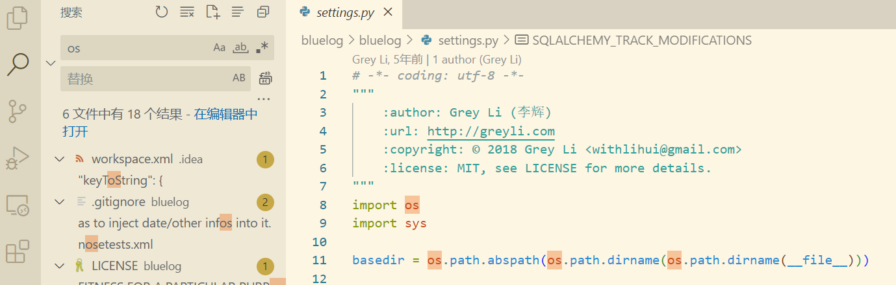
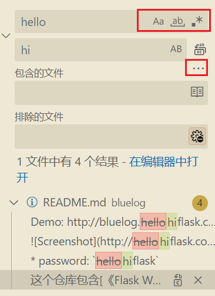
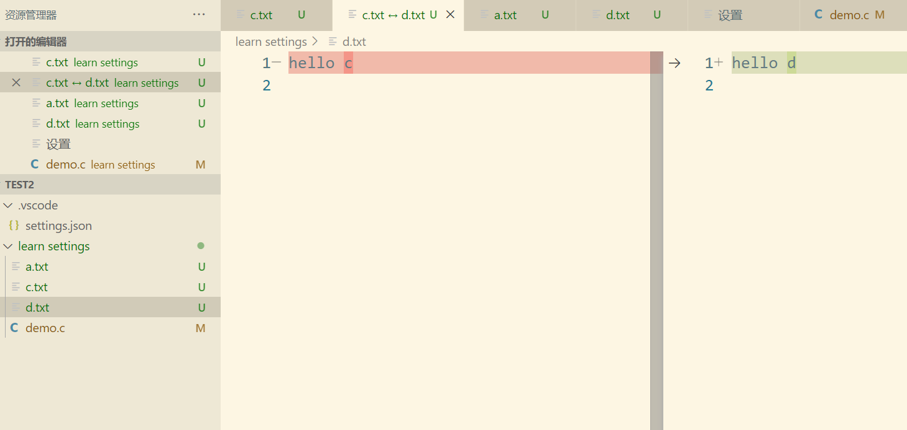

# VSCode使用教程

学习资料推荐：

[ VScode中文文档 (gitbooks.io)](https://jeasonstudio.gitbooks.io/vscode-cn-doc/content/)

[一位博主的网页](https://vscode.cool/)


[TOC]

## 页面布局和功能介绍

### 用户界面概览


VS Code的用户界面一共由五大部分组成，分别是：

1. 底部的Status Bar（状态栏），用于显示当前被打开文件的一些信息。
2. 最左侧的Activity Bar（活动栏），它里面包含了VS Code五个重要功能的入口点。
3. Activity Bar旁边的Side Bar（侧边栏），它里面包含了Activity Bar五个功能点的详细内容。
4. 右侧，占据空间最多的Editor（编辑器），用于编写代码。
5. 编辑器下方的Panels（面板），它包含了4个不同的面板，其中的Terminal面板我们会经常用到（**在终端部分即可以打开**）

### 活动栏

#### 资源管理器

主要用于管理文件。这里只需要注意一个使用技巧，就是如果要在指定的文件夹下添加文件需要先选定该文件夹，在点击上面的添加文件即可。


这里推荐打开`open editors`,`demo`,`oulines`三个部分。

1. 在OPEN EDITORS里面，它以列表的形式列出了当前所有被打开的文件，我们可以将鼠标移动到OPEN EDITORS的右侧，这时会出现三个功能键，通过点击最右侧那个带有叉叉图标的按键，我们就可以**一键关闭所有当前被打开的文件**。这样不用一个一个的去关闭，方便管理。
2. demo就是你整个文件的目录
3. 大纲能以树状的形式帮你显示你当前打开的文件的代码结构。这种形式会方便看文件的结构，**如果想快速的定位到指定的位置，我们可以点击outline中部分，就能实现快速的跳转。**

#### search tool搜索

**在搜索栏中主要实现了查找和替换功能，可以方便的进行查找和替换。选择在那个文件中替换就行。**



高级功能设置



具体包括了大小写敏感支持正则，以及缩减查询范围等，使得查询的结果更加准确，具体可以用鼠标停留在上面就可以看到功能说明了。

#### source control源代码管理

使用Git来进行版本控制


下拉可以选择可以操控的功能。

vscode对文件的对比有着很好的支持，其中蓝色表示有修改，红色表示删除，绿色表示新增。单击那些部分还能查看之前的样子，使用红色方框部分的功能可以实现对原来数据的恢复等功能。


####  DEBUG模块

##### 基础功能说明


###### sidebar的使用


调用堆栈可以是形象化的堆栈，是函数入栈的一个体现（后入先出），点击函数，就会在代码编辑区跳转到该函数的位置。


变量部分可以帮助我们查看相应的变量，如果先太麻烦可以在监视部分查看相应的变量。

###### toolbar的使用


**continue**，它的作用是**立即跳到下个断点**，如果后面没有断点了，那么程序就会运行到最后一行代码，在Web后端开发中，为了调试一个请求处理函数，我们常常会利用continue来释放被阻塞的请求。

**stop**，它的作用很简单，用于**立即中断调试**，当我们想要放弃调试时，就可以使用它。

**restart**，它的作用也很简单，用于**立即重启调试**，当我们在调试过程中修改了源代码，为了让修改生效，我们就可以使用它来重启调试。

接下来，是有点让人迷惑的**step over**和**step into**了，之所以让人迷惑，是因为他俩既有相似点也有不同点，关键在于**当前行是否存在函数调用**，如果存在，那他俩的作用一样：都是**单步执行**，如果不存在，**step over**会直接拿到函数的返回结果并运行至下一行，而**step into**则会进入当前行函数并运行至该函数的第一行。所以，如果当前行存在函数调用，选择**step over**还是**step into**，就要看我们对这个函数内部实现细节感不感兴趣了，感兴趣的话就用**step into**，不感兴趣的话就用**step over**。

最后一个是**step out**，它和**step into**刚好相反，**step into**是跳入函数，而**step out**则是跳出函数。它的使用场景常常是：当我们身处某个函数内部，同时这个函数的代码行数又很多，我们可能利用单步调试，运行了前面几行代码过后，就达到了自己的调试目的，这时候为了避免再单步执行后面大段我们不感兴趣的代码，我就可以使用它来快速跳出当前函数，节省时间。

##### 调试插件

##### launch.json（需要补充）

launch.json是用于**调试的配置文件**，它有下述几个功能

1. 指定语言环境
2. 指定调试类型
3. 其他一些功能

###### 创建launch.json

一般而言vscode会帮助我们自动创建一个launch.json文件。但是有些时候需要我们手动去添加一些配置，这个时候，我们点击DUBUG窗口，会提示我们创建launch.json文件。点击之后，就会在我们项目之中创建一个`.vscode`文件夹，在这个文件夹之下，就有`launch.json`文件。

除了Node.js以外，其它场景的调试，我们都需要配置launch.json这个文件，所以学习和理解launch.json就显得格外重要。

launch.json是用于调试的配置文件，这个配置文件里会指定一些非常重要的信息，比如说，当前调试的程序是什么语言编写的，是Java？是C#？还是C？等等。这个关键的信息必须要在launch.json中指定，为了指定这个信息，我们需要借助配置项`type`。

除了`type`，还有一个配置项也很重要，叫做`request`，它有两个值可供选择，一个叫`launch`，一个叫`attach`。使用`launch`我们可以让VS Code去启动我们的程序，同时启动后的程序还支持调试。而`attach`的方式有点不一样，它并不会帮我们启动程序，而是通过为一个**已经在运行且还不支持调试**的程序**注入一个调试器**，让这个程序从不支持调试变成支持调试。

下面是对`launch.json`的一个示例说明：

```json
{
    //需要使用,隔开，每个参数以键值对的方式存在
    "version": "0.2.0",        //这是版本号
    //configurations是一个数组，数组的每个对象是一个调试配置项
    //name,type,request是三个必选的参数
    //type指定编程环境
    //name给配置项一个简单的名字
    //request:指定调试模式，只有两种launch和attach
    "configurations": [
        {
            "name": "Python: Current File",
            "type": "python",
            "request": "launch",
            "program": "${file}",
            "console": "integratedTerminal",
            "justMyCode": true
        }
    ]
}
```


##### 调试技巧

###### 日志断点

主要用于web调试，在打断点的时候，使用添加日志断点，那么对于一个web项目就会以非阻塞的方式来记录调试日志，并在终端输出。


###### 条件断点

只有当条件满足的时候，才会成为断点，不然会被忽略。用于减少调试的断点。


###### 行内断点（待补充）

如果一行代码有多个函数调用，可以把断点直接打在某个函数上。前端使用较多，学到前端再回头补上。

###### 多调试进程（待补充，配置好Java再来解决）

#### extension拓展

plugin更多指的是插件，extension更多指拓展。VS Code的扩展非常的丰富，大致可以分成以下三类：

- **写代码相关**： 这一类的扩展最多，比如格式化代码的 “Prettier”、调试PHP代码的 “PHP Debug”等
- **工具**：这些扩展以工具的形式集成在了VS Code当中，比如用于远程开发的 “Remote SSH”
- **自定义相关**：比如用于更换主题、语言包、快捷键的扩展

拓展的安装目录：

- `mac`:`user/vscode/extensions`
- `windows`:`用户目录\.vscode\extensions`

### Manager管理

#### 命令面板command palette

通过输入命令来执行一些操作

只需要输入关键词找到命令，通过鼠标点击或者键盘回车就可以使用命令了。

快捷键调出命令的是`ctrl+shift+p`

> 一些常用的操作
>
> - fold all代码块折叠
> - ctrl+shift+`+`放大字体，`-`为缩减字体

#### 设置settings

##### users

满足我们个性化的设置，作用于所有的项目


注意导航栏和搜索栏的应用，如果修改过，会在左侧有一个蓝色的图片，点击齿轮能恢复默认值。

**设置部分，其实就是对settings.json文件的一个可视化展示。打开settings.json的一个方法为`command palette->输入setting->open Settings(Json)`**

`settings.json`里面存放的是在设置中所更改过的部分，如果在里面删除这个部分，那么就会将该设置为默认值，反之如果更改了这个设置，就会在`settings.json`中添加这部分设置。


##### workspace

常用于团队协作保持代码风格统一，常用于单个项目的开发。

因此没创建一个项目的时候，会在`.vscode`项目中，出现`settings.json`文件用于项目环境设置的统一

此外，workspace里面的设置优先级高于用户下的设置

#### user snippets

设置代码块，通过`关键词+tab键=>代码块`，方便于快速编写代码，提升开发效率。

在settings中的用户代码片段（user snippets）中，可以选择语言，之后将进入到一个`name.json`例如`python.json`的文件中。

```json
{
	"using stdio":{                      //这是描述，当输入快捷方式的时候，会出现这个描述
		"prefix": "io",                  //这是快捷方式
		"body": [                        //这是一个列表对应使用快捷方式会粘贴的代码块
			"#include <stdio.h>"
		]
	}
}
```

一些书写语法

```json
$num    //可以让光标停留才该位置
${num||枚举值}     //可以为该值添加枚举的选项
```

[可以使用这个网址在线生成代码片段的json内容](https://snippet-generator.app/)

### sidebar

隐藏sidebar快捷键：

- Windows:`ctrl+B`
- mac:`command+B`


这样就能对隐藏sidebar。

### editor编辑栏


**zen mode**

禅模式，专注于写代码。可以在`view> apprearance > Zen Mode`中打开，或者使用控制面板，输入`zm`.使用`Esc`退出

快捷键：

- `win`:`ctrl+k+z`
- `mac`:`cmd+k+z`

### 面板

#### 面板

PROBLEMS, OUTPUT以及DEBUG CONSOLE这三个面板，基本上都是往外输出一些信息，在平时的项目开发过程中，在合适的时候，如果我们能够利用 这些信息，就能够为项目开发带来一定的帮助。这三个面板它们的具体功能如下：

- PROBLEMS：它会列出项目中存在问题的代码，而问题可以分成两种，一种是Warning，代表我们的代码写得并没有错，但是写得不够好，另一种是Error，代表我们的代码写得有错误。
- OUTPUT：它会显示出VS Code自身以及第三方扩展的一些日志信息。
- DEBUG CONSOLE：它有三个功能，第一，会显示调试器自身的日志信息，第二，会显示项目本身包含的控制台输出，第三，在调试过程中，可以输出本地变量，以及利用本地变量组成的表达式的值。

##### terminal

> terminal的定义：
>
> ​	是一个工具负责提供命令的输入，输出环境，以及shell的切换功能
>
> shell的定义：
>
> ​	计算机主要有两种方式，一种是GUI界面，一种是CLI（命令行）来进行人机交互。为了使用文本命令来操  	控计算机，我们需要一种工具，能将文本命令转换为机器码,这就是CLI也称为shell.即shell就是一个解释命	令的程序，常见的有（cmd,powershell,zsh,bash等）。

打开快捷键：`ctrl+1左边那个点`


#### 状态栏


这里有一个小技巧，当我们从网页上复制的代码缩进之类有很大的问题的时候，我们可以利用vscode创建临时文件来帮助我们修改其格式。

`ctrl+n创建临时文件`-->`status bar里面选择合适的文件类型`-->`shift+alt+F格式化`

## 文件以及文件夹的使用技巧

vscode中并没有专门的创建项目的工具，我们需要使用命令或者安装第三方扩展来进行项目的快速创建。

如果想隐藏某些文件或者文件夹，可以去settings->exclude选项中设置

### 文件基本使用

vscode有很强大的文件使用功能，具体包括，查找路径，在文件资源器中打开等，可以右键就能查看。

> 多级目录的创建，可以直接以目录结构的形式新建文件


### 使用技巧

#### 多窗口打开文件

vscode的默认文件打开模式是preview mode（tab上的文件字体为斜体），新打开的文件会覆盖当前的tab，如果想使用多tab的话，可以使用下面几种方式来解决.

1. 双击文件打开，会默认文件以非preview mode的形式打开
2. 双击文件上的tab就行

#### 寻找文件的方式

> 1.知道文件名

使用快捷键`ctrl+P`能打开一个搜索文件框，输入文件即可。

>2.不知道文件名，但是知道文件内容以及文件所在目录


在该文件下选择，在文件中查找，输入内容即可查找

> 3.查找历史文件项目

可以利用`ctrl+R`调出搜索框，然后查看已经打开过的项目。可以在搜索框中输入进行进一步的筛选。


#### 文件内的搜索

`ctrl+F`能在文件内查找内容。本质上与Search相同，但是这个范围定位到了特定的一个文件。


注意对区分大小写和全字匹配和正则匹配的使用。

**可以ctrl+F调出选项来之后，在对文章内容选择，就可以在选择的部分进行查找，可以利用此缩小范围**

**多行搜索：**

使用`ctrl+enter`可以换行


#### 固定文件和拆分文件

右键`tab`,然后选择固定即可帮文件固定。固定的文件总是出现在最左侧，而且close all的时候，不会被关闭。对于比较重要的文件可以使用这种方式，很方便快捷。

拆分文件

#### 文件内容

如果可以对文件设置自动保存以及相应的代码格式补全，但是对某些语言来说需要安装插件才能有这些功能。

> 文件内容比较

不同文件比较先选中一个文件，然后按住`ctrl`选中其他文件，之后右键选择比较就行。

或者可以利用`code -d c.txt d.txt`



**相同文件比较**

1. 利用版本控制，然后在版本控制里面打开文件就可以对比最后一次commit与现在修改了那些内容
2. 利用资源管理器中的`timeline`显示文件的历史记录，然后右键在选择栏中选择作为比较对象，在另外一个版本中，选择作比较就可以对两个版本进行比较。**这样能实现任意版本的比较**


> 资源管理器里面的timeline用于管理追踪文件的git历史以及文件的更改历程


> 撤销文件内容的修改

建议使用版本控制来进行，有了版本控制之后就能有很多方便的操作


> 文件保存

有三种方式：

- 方式一：通过菜单栏选项。File -> Save All。
- 方式二：通过快捷键。macOS是“Option + Mac + S”， Windows是“Ctrl + Shift + S”。
- 方式三：通过命令。打开Command Palette，输入“saveall”，找到命令“Save All”。


#### 屏幕投影模式

VS Code里有一个特殊的功能叫做`Screencast Mode`，一旦我们将它开启，当我们的鼠标在源文件中移动时，VS Code会以一个红色的圆圈来提醒，当我们在键盘上输入任何一个字符时，它也会在屏幕中即时显示出当前按键字符。当我们参加一个代码`review`会议或者是制作一些代码编辑技巧的视频教程时，这个功能将会显得格外有用，它可以让观众更好的接受我们想要表达的信息。

为了开启这个功能，首先我们需要打开`Command Palette`，接着在输入框中输入`screencast mode`，找到命令`Toggle Screencast Mode`然后执行，这样我们就开启了这个功能。为了关闭这个功能，我们只需要将这条命令再执行一遍就可以了。

### 阅读错误信息

错误信息一般为`文件名 行号：列号`，例如：

```bash
demo.c:4:24: error: expected ';' after expression
    puts("hello world")
                       ^
                       ;
1 error generated.
```

如果我们想要快速定位到错误的位置，可以使用`ctrl+G`打开行号和列号的检索，根据错误信息进行快速的跳转到错误信息的位置。

**或者利用`ctrl+P`,然后使用`filename:line:column`号的形式来快速定位文件名到相应的位置。**

## 自定义VSCode（待定）


## 拓展（待定）


## 代码编辑技巧（待定）


## 具体的开发使用（待定）


